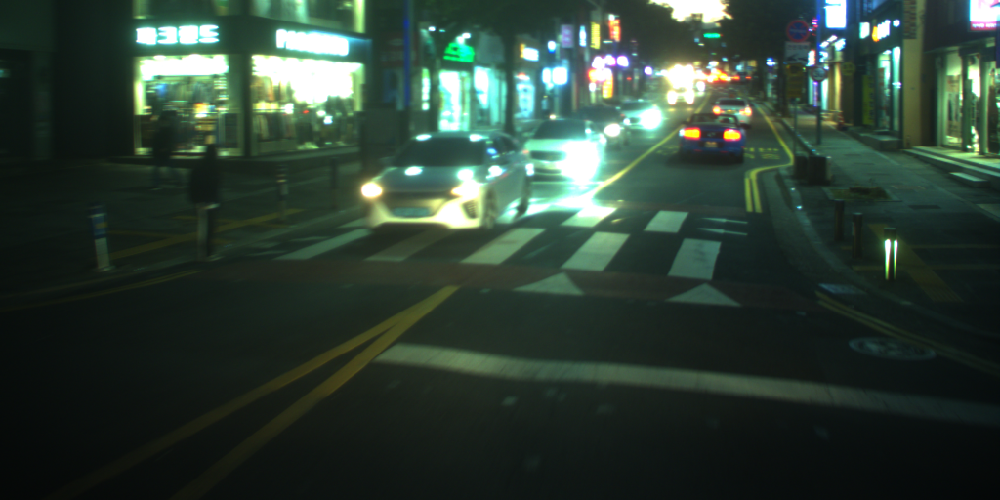

# NIA 주행환경 정적객체 데이터셋을 위한 차선-횡단보도 Semantic Segmentation

* <a href="https://arxiv.org/abs/1411.4038">FCN ResNet50</a> 기반 차선-횡단보도 Semantic Segmentation의 학습, 예측을 위한 코드와 모델을 제공합니다.
* 백그라운드, 차선, 정지선, 횡단보도의 4개 클래스로 이미지 픽셀을 분류합니다.

## Demo



## Requirements

다음과 같은 python 라이브러리들이 필요합니다.

- numpy
- torch
- torchvision
- pytorch-lightning
- opencv-python
- matplotlib
- ujson


## Training
```
python train.py
```

## Inference
```
python test.py
```

## Pretrained Model
[Link](https://drive.google.com/file/d/1IBHWsfij_fouIHyFhTHkvsyqLnvzPkcj/view?usp=sharing)


## Benchmark
| Model | Accuracy | Accuracy_class |  mIoU | Frequency-Weighted IoU |
| --  | -- | -- | -- | -- |
| FCN ResNet50  | 97.9% | 77.4% | 71.6% | 96.0% |
| FCN ResNet50 + Focal Loss | **98.1%** | 79.9% | **73.4%** | **96.3%** |
| FCN ResNet50 + 1 / sqrt(class frequency) weighted Loss | 97.50% | **92.69%** | 70.19% | 95.76% |
* Class별 IoU

| Class | FCN ResNet50 | FCN ResNet50 + Focal Loss | FCN ResNet50 + 1 / sqrt(class frequency) weighted Loss |
| -- | -- | -- | -- |
| Background | 97.8% | **98.0%** | 97.44% |
| 차선 | 70.2% | **70.4%** | 65.24% |
| 정지선 | 56.2% | **57.5%** | 41.32% |
| 횡단보도 | 62.1% | 67.7% | **76.75%** |

## Acknowledgements

- [Pytorch torchvision FCN ResNet50](https://pytorch.org/docs/stable/torchvision/models.html#semantic-segmentation)
- [Long, Jonathan, Evan Shelhamer, and Trevor Darrell. "Fully convolutional networks for semantic segmentation." Proceedings of the IEEE conference on computer vision and pattern recognition. 2015.](https://arxiv.org/abs/1411.4038)
- [Lin, Tsung-Yi, et al. "Focal loss for dense object detection." Proceedings of the IEEE international conference on computer vision. 2017.](https://arxiv.org/abs/1708.02002)
